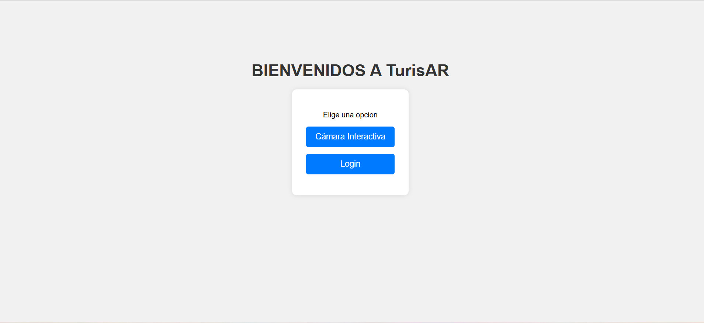
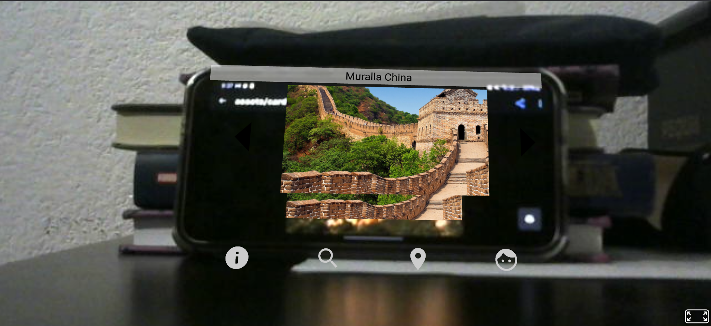
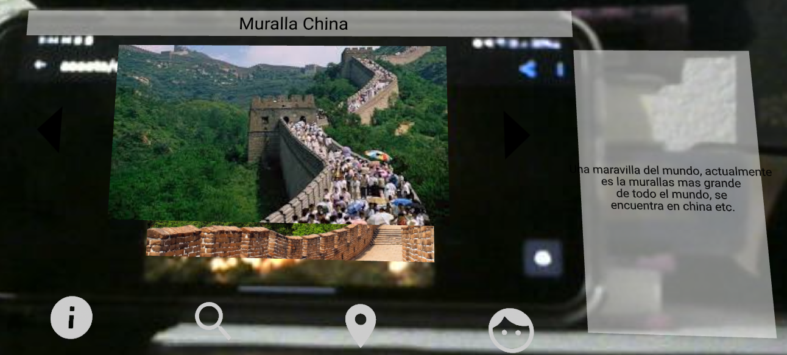
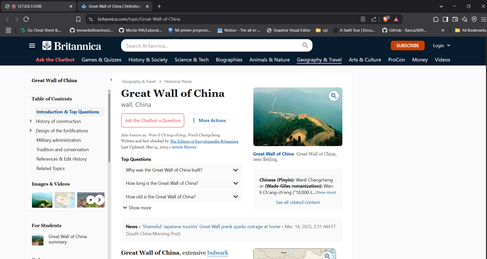
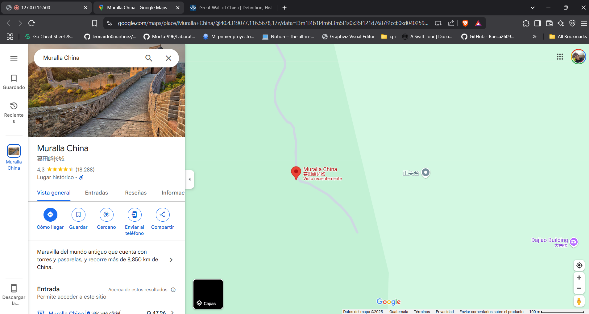
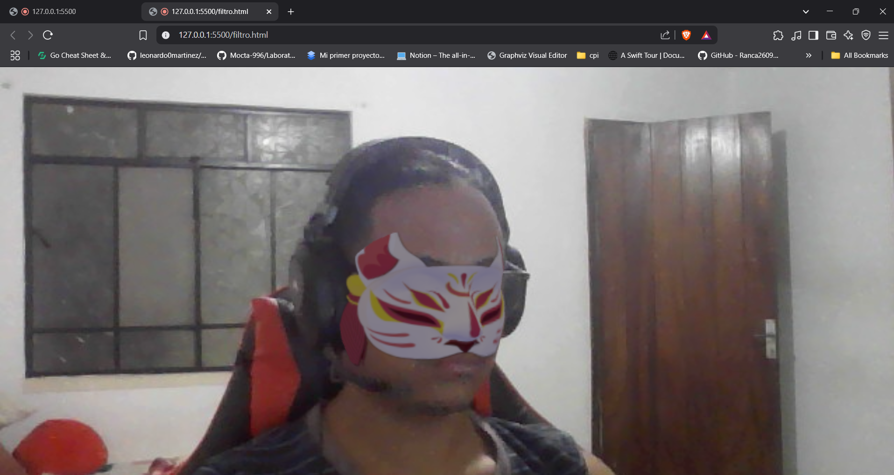
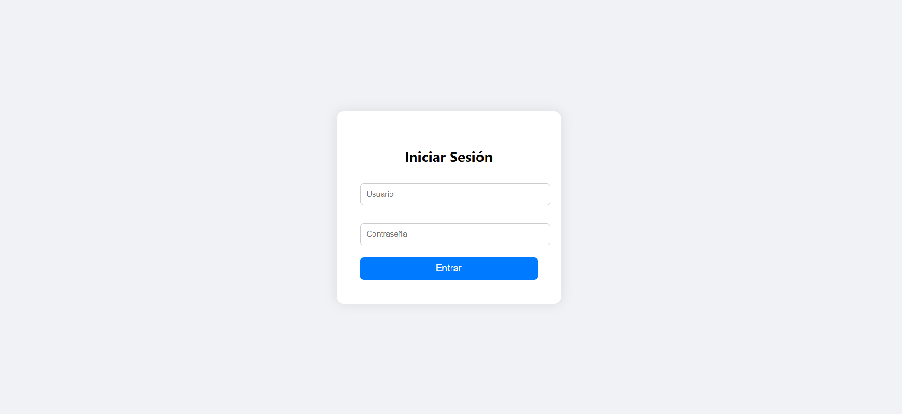

# IA2_1S2025_P2_G16
Este repositorio contiene el proyecto 2 de Inteligencia Artificial

## Integrantes
|Nombre | Carnet|
|------|--------|
| Marco Antonio Solis Gonzalez | 202003220 |
| Max Rodrigo Durán Canteo | 201902219 |
| Luis Mariano Moreira Garcia | 202010770 |

# MANUAL DE USUARIO  

**Página principal**  
Aquí podremos seleccionar dos opciones:  
- **Cámara Interactiva**: Módulo principal donde podremos reconocer las 7 maravillas del mundo y de Guatemala.  
- **Login**: Módulo administrador en el cual podremos agregar, editar y borrar sitios turísticos.    

**Página Interactiva (Módulo Usuario)**  
En esta sección se reconocerá el sitio turístico y se mostrará un menú interactivo donde podremos seleccionar diversas opciones.  

**1)** Botón de Información: Al seleccionarlo, se mostrará información relevante del sitio.  

**2)** Botón de Búsqueda: Nos redireccionará a un sitio web referente al sitio turístico.  

**3)** Botón de Ubicación: Nos redireccionará a la ubicación en Google Maps del sitio turístico.  

**4)** Botón de Filtro: Aquí se abrirá una nueva pestaña en la cual, por medio de la cámara, se colocará un filtro en nuestro rostro.  

**Página Interactiva (Módulo Administrador)**  
Nos pedirá iniciar sesión.  
