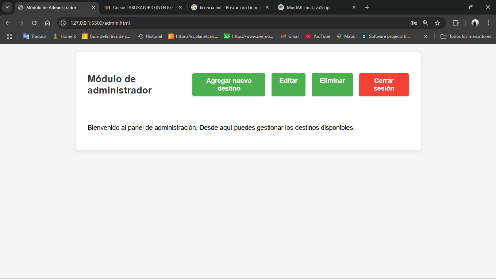
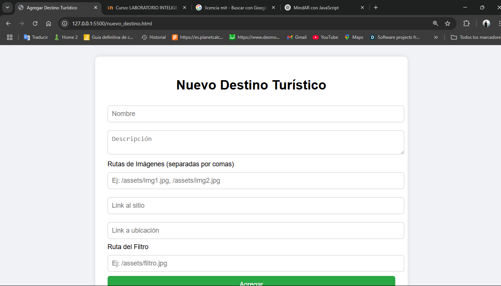
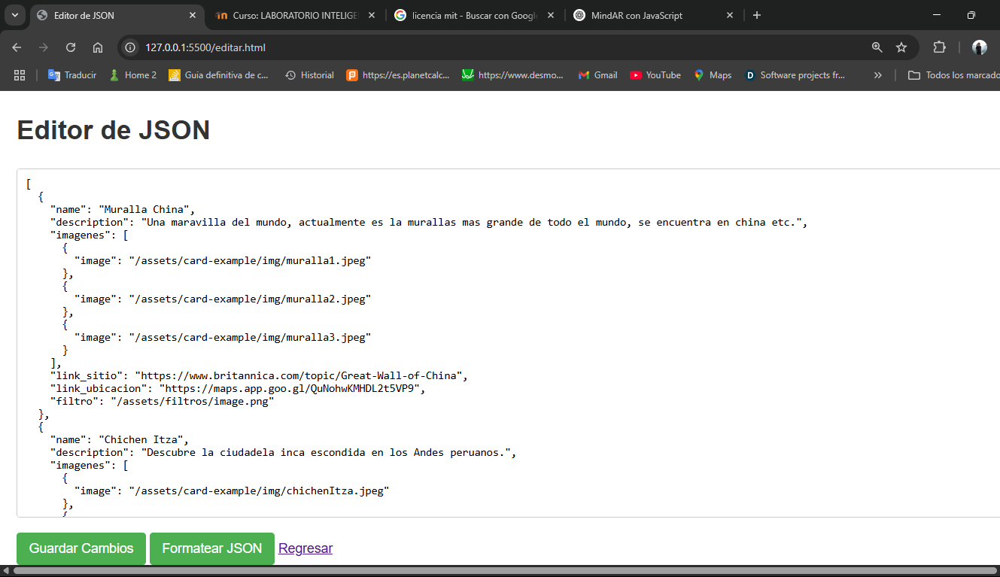
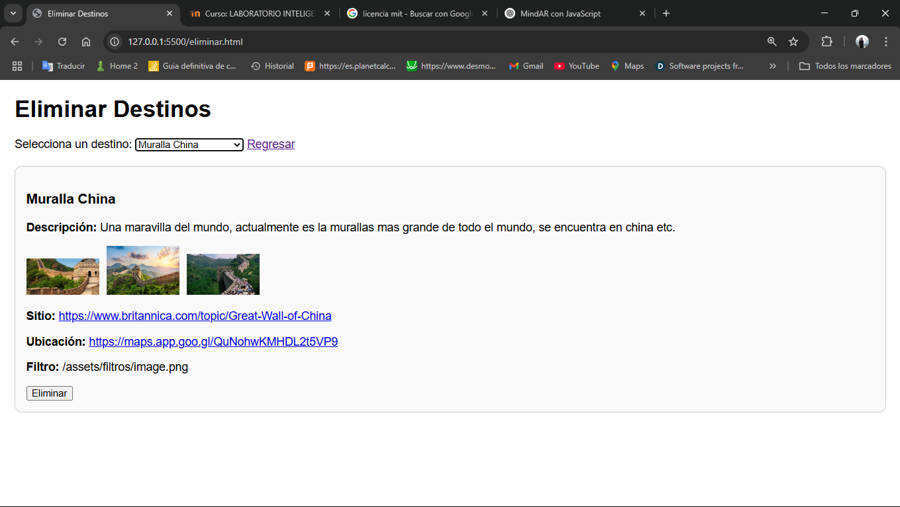

# IA2_1S2025_P2_G16
Este repositorio contiene el proyecto 2 de Inteligencia Artificial

## Integrantes
|Nombre | Carnet|
|------|--------|
| Marco Antonio Solis Gonzalez | 202003220 |
| Max Rodrigo Durán Canteo | 201902219 |
| Luis Mariano Moreira Garcia | 202010770 |


# MANUAL DE USUARIO  

**Página principal**  
Aquí podremos seleccionar dos opciones:  
- **Cámara Interactiva**: Módulo principal donde podremos reconocer las 7 maravillas del mundo y de Guatemala.  
- **Login**: Módulo administrador en el cual podremos agregar, editar y borrar sitios turísticos.    


**Página Interactiva (Módulo Usuario)**  
En esta sección se reconocerá el sitio turístico y se mostrará un menú interactivo donde podremos seleccionar diversas opciones.  


**1)** Botón de Información: Al seleccionarlo, se mostrará información relevante del sitio.  


**2)** Botón de Búsqueda: Nos redireccionará a un sitio web referente al sitio turístico.  


**3)** Botón de Ubicación: Nos redireccionará a la ubicación en Google Maps del sitio turístico.  


**4)** Botón de Filtro: Aquí se abrirá una nueva pestaña en la cual, por medio de la cámara, se colocará un filtro en nuestro rostro.  


**Página Interactiva (Módulo Administrador)**  
Nos pedirá iniciar sesión.  


Seleccionaremos.  


Insertar


Editamos

Eliminamos



# MANUAL TECNICO

# Manual Técnico: MindAR con JavaScript

## Tabla de Contenidos
1. [Introducción a MindAR](#introducción-a-mindar)
2. [Configuración Inicial](#configuración-inicial)
3. [Componentes Clave](#componentes-clave)
4. [Explicación del Código](#explicación-del-código)
5. [Flujo de Trabajo](#flujo-de-trabajo)
6. [Creación de Targets](#creación-de-targets)
7. [Buenas Prácticas](#buenas-prácticas)
8. [Ejemplo de Interacción](#ejemplo-de-interacción)
9. [Conclusión](#conclusión)

---

## Introducción a MindAR
**MindAR** es un framework de realidad aumentada web basado en:
- ✅ **WebXR** (sin apps nativas)
- ✅ Compatibilidad con **A-Frame** y **Three.js**
- ✅ Seguimiento de imágenes multiplataforma
- ✅ Open Source (MIT License)

**Casos de uso**:
- Educación interactiva
- Marketing digital
- Museos virtuales
- Catálogos de productos

---
# Funcionamiento de `index.js` en MindAR

## Estructura Básica del Archivo

El archivo `index.js` complementa el HTML para añadir:
- **Lógica de interacción**
- **Manejo de eventos AR**
- **Control de estados**

```javascript
// Ejemplo de estructura típica
document.addEventListener('DOMContentLoaded', () => {
  // 1. Inicialización
  // 2. Configuración de eventos
  // 3. Funciones personalizadas
});

Componentes Clave
1. Registro de Componentes A-Frame
javascript

AFRAME.registerComponent('mytarget', {
  init: function() {
    // Lógica cuando el componente se adjunta
  }
});
2. Eventos de MindAR
Evento	Descripción
targetFound	Cuando se detecta el target
targetLost	Cuando el target sale de vista
targetUpdate	Mientras el target es visible
javascript

entity.addEventListener('targetFound', () => {
  console.log("¡Target detectado!");
});
Funciones Principales (Ejemplo)
1. Control de Visibilidad
javascript

function toggleElement(id, visible) {
  const el = document.querySelector(id);
  el.setAttribute('visible', visible);
}

// Uso:
toggleElement('#portfolio-panel', true);
2. Manejo de Botones Interactivos
javascript

document.querySelectorAll('.clickable').forEach(btn => {
  btn.addEventListener('click', (e) => {
    const targetId = e.target.id;
    switch(targetId) {
      case 'web-button':
        window.open('https://example.com');
        break;
      case 'email-button':
        // Lógica para email...
    }
  });
});
Flujo de Ejecución Típico
Inicialización:

javascript

const scene = document.querySelector('a-scene');
scene.addEventListener('loaded', initAR);
Configuración de Eventos:

javascript

function initAR() {
  const targets = document.querySelectorAll('[mindar-image-target]');
  targets.forEach(target => {
    target.addEventListener('targetFound', showContent);
  });
}
Gestión de Estados:

javascript

let currentSlide = 0;

function nextSlide() {
  currentSlide = (currentSlide + 1) % 3;
  updateSlideVisibility();
}
Patrones Comunes
1. Animaciones Programáticas
javascript

entity.setAttribute('animation', {
  property: 'rotation',
  to: '0 360 0',
  dur: 2000,
  loop: true
});
2. Comunicación entre Componentes
javascript

// Emisor
entity.emit('showInfo', { detail: { text: "Hola Mundo" } });

// Receptor
entity.addEventListener('showInfo', (e) => {
  document.querySelector('#text').setAttribute('value', e.detail.text);
});
Ejemplo Completo: Carrusel AR
javascript

// En index.js
let currentProject = 0;
const totalProjects = 3;

document.querySelector('#portfolio-right-button').addEventListener('click', () => {
  currentProject = (currentProject + 1) % totalProjects;
  updateProjectDisplay();
});

function updateProjectDisplay() {
  // Oculta todos
  document.querySelectorAll('[id^="portfolio-item"]').forEach(el => {
    el.setAttribute('visible', false);
  });
  
  // Muestra el actual
  document.querySelector(`#portfolio-item${currentProject}`)
    .setAttribute('visible', true);
}
Depuración
Métodos Útiles
javascript

// 1. Log de estados
console.log('Target activo:', entity.is('mindar-image-target'));

// 2. Visualización de raycast
document.querySelector('[raycaster]').components.raycaster.showLine = true;

// 3. Stats de rendimiento
scene.setAttribute('mindar-image', 'showStats: true');
Mejores Prácticas para index.js
Modularización:

javascript

// events.js
export function setupAREvents() { ... }

// main.js
import { setupAREvents } from './events.js';
setupAREvents();
Optimización:

Usar requestAnimationFrame para animaciones

Limpiar event listeners cuando no se necesiten

Compatibilidad:

javascript

if (!AFRAME.components['mindar-image']) {
  console.error('MindAR no está cargado!');
}
Nota: El archivo adjunto al HTML (./index.js) probablemente implementa estas u otras funcionalidades similares para controlar la experiencia AR mostrada en el documento principal.

```
# Análisis del Módulo de Administrador (`admin.html`)

## Estructura General
- **Tipo de documento**: Página HTML5 en español (`lang="es"`)
- **Propósito**: Panel de control para administradores con funcionalidades CRUD básicas

## Componentes Principales

### 1. Cabecera
```html
<div class="header">
    <p class="title">Módulo de administrador</p>
    <div class="btn-container">
        <a href="./nuevo_destino.html" class="btn btn-agregar">Agregar nuevo destino</a>
        <a href="./editar.html" class="btn btn-agregar">Editar</a>
        <a href="./eliminar.html" class="btn btn-agregar">Eliminar</a>
        <a href="./login.html" class="btn btn-cerrar">Cerrar sesión</a>
    </div>
</div>